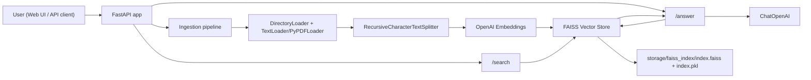
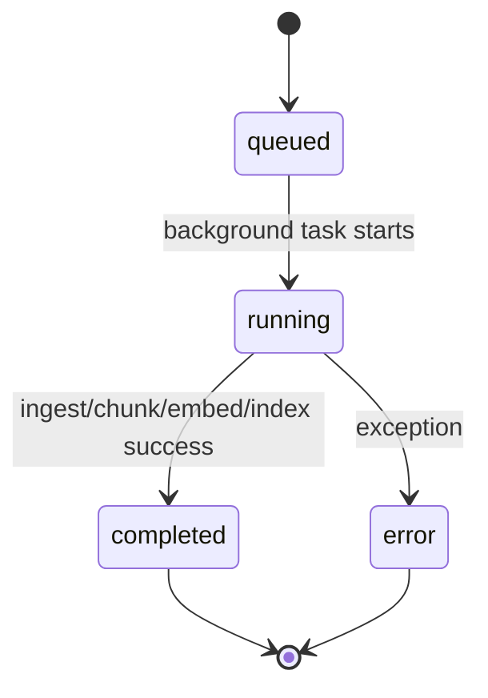
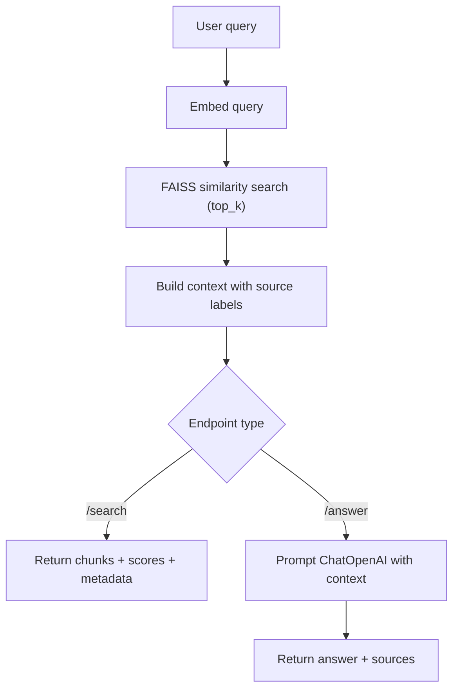

# LLM Document Search & Analysis System

A Retrieval-Augmented Generation (RAG) application for large document collections.

This project lets you:
- Ingest `.txt`, `.md`, and `.pdf` files.
- Split content into chunks and generate embeddings.
- Store vectors in a local FAISS index.
- Run semantic search.
- Generate context-grounded answers from retrieved chunks.
- Monitor ingestion progress in real time from the web UI.

## Table of Contents
- [1. What This Project Does](#1-what-this-project-does)
- [2. End-to-End Flow](#2-end-to-end-flow)
- [3. Architecture Diagrams](#3-architecture-diagrams)
- [4. Tech Stack](#4-tech-stack)
- [5. Project Structure](#5-project-structure)
- [6. Setup](#6-setup)
- [7. Running the App](#7-running-the-app)
- [8. Step-by-Step Usage](#8-step-by-step-usage)
- [9. API Reference](#9-api-reference)
- [10. Ingestion Progress Model](#10-ingestion-progress-model)
- [11. Configuration](#11-configuration)
- [12. Data, Privacy, and Cost Notes](#12-data-privacy-and-cost-notes)
- [13. Troubleshooting](#13-troubleshooting)
- [14. Development Notes](#14-development-notes)

## 1. What This Project Does

At a high level, the system turns your documents into vectors, then uses vector similarity to find relevant chunks for a user query.

For `/search`, it returns the most relevant chunks directly.

For `/answer`, it performs retrieval first, then calls the LLM with only retrieved context and returns an answer plus sources.

## 2. End-to-End Flow

1. Place documents into a folder (usually `data/`).
2. Trigger ingestion from UI or `POST /ingest`.
3. Server loads documents by glob patterns.
4. Text is chunked with overlap.
5. Each chunk is embedded via OpenAI embeddings.
6. Chunk vectors are stored in FAISS.
7. User asks query via `/search` or `/answer`.
8. Query is embedded and nearest chunks are retrieved from FAISS.
9. For `/answer`, retrieved chunks are packed into context and sent to the chat model.
10. UI shows results and sources.

## 3. Architecture Diagrams

### 3.1 System Architecture



### 3.2 Ingestion Job Lifecycle



### 3.3 Query and Answer Flow



## 4. Tech Stack

- Python 3.10+
- FastAPI + Uvicorn
- LangChain components
- FAISS (`faiss-cpu`) for vector index
- OpenAI embeddings and chat model
- Static frontend (HTML/CSS/JS)

## 5. Project Structure

```text
llm-doc-search/
  main.py                  # FastAPI app, ingestion/search/answer logic
  cli.py                   # CLI for ingest/search/answer/stats
  requirements.txt
  .env.example
  static/
    index.html             # Web UI
    app.js                 # UI logic + polling ingestion jobs
    styles.css
  data/                    # Put source documents here
  storage/                 # Persisted FAISS index
```

## 6. Setup

### 6.1 Clone / Enter Project

```bash
git clone https://github.com/saiprasanthg/llm-doc-search.git
cd llm-doc-search
```

### 6.2 Create Environment File

```bash
cp .env.example .env
```

Set at minimum:

```env
OPENAI_API_KEY=your_key_here
```

### 6.3 Create Virtual Env and Install

```bash
python3 -m venv .venv
source .venv/bin/activate
pip install -r requirements.txt
```

## 7. Running the App

### 7.1 Start Server

```bash
python main.py
```

Default URL: `http://127.0.0.1:8000`

`main.py` can auto-open a browser tab (controlled by `AUTO_OPEN_BROWSER`, default `1`).

### 7.2 Development Reload Mode

```bash
python -m uvicorn main:app --reload
```

## 8. Step-by-Step Usage

### 8.1 Prepare Documents

Add files under `data/`:
- `*.txt`
- `*.md`
- `*.pdf`

### 8.2 Ingest Documents

From web UI:
1. Open `/`.
2. Enter source directory (for example `data`).
3. Click `Run Ingestion`.
4. Watch progress bar and flow-state indicators.

From API:

```bash
curl -X POST http://127.0.0.1:8000/ingest \
  -H "Content-Type: application/json" \
  -d '{"source_dir": "data", "persist": true}'
```

Example response:

```json
{"job_id":"a1b2c3...","status":"queued"}
```

Poll job status:

```bash
curl http://127.0.0.1:8000/ingest/<job_id>
```

### 8.3 Run Semantic Search

```bash
curl -X POST http://127.0.0.1:8000/search \
  -H "Content-Type: application/json" \
  -d '{"query":"How does ingestion work?","top_k":5}'
```

### 8.4 Generate Grounded Answer

```bash
curl -X POST http://127.0.0.1:8000/answer \
  -H "Content-Type: application/json" \
  -d '{"query":"Summarize the ingestion pipeline.","top_k":5}'
```

## 9. API Reference

### `GET /`
Serves web UI (`static/index.html`).

### `GET /api`
Returns project identity and readiness.

### `GET /health`
Simple health check.

### `GET /stats`
Returns whether vector store is loaded and total indexed vectors.

### `POST /ingest`
Starts asynchronous ingestion job.

Request body:

```json
{
  "source_dir": "data",
  "patterns": ["**/*.txt", "**/*.md", "**/*.pdf"],
  "persist": true
}
```

Response:

```json
{
  "job_id": "uuid",
  "status": "queued"
}
```

### `GET /ingest/{job_id}`
Returns job state with progress.

Example response while running:

```json
{
  "job_id": "uuid",
  "status": "running",
  "step": "embed",
  "progress": 72,
  "message": "Embedded 320/450 chunks",
  "payload": {
    "source_dir": "data",
    "patterns": null,
    "persist": true
  },
  "result": null,
  "error": null
}
```

### `POST /search`
Performs semantic retrieval only.

Request body:

```json
{
  "query": "your question",
  "top_k": 5
}
```

Response includes:
- `results[].text`
- `results[].score`
- `results[].metadata`

### `POST /answer`
Performs retrieval + generation with source attribution.

Request body:

```json
{
  "query": "your question",
  "top_k": 5
}
```

Response includes:
- `answer`
- `sources[]` with `source`, `chunk_id`, `score`

## 10. Ingestion Progress Model

The UI visual progress is backed by backend step updates:

- `ingest`: scan/load documents (`0` to `10`)
- `chunk`: split docs into chunks (`10` to `35`)
- `embed`: batch embeddings + upsert vectors (`35` to `90`)
- `index`: persist FAISS to disk (`95` to `100`)

Progress is approximate, not exact wall-clock time.

## 11. Configuration

Environment variables used by `main.py`:

- `OPENAI_API_KEY`
- `OPENAI_MODEL` (default `gpt-5-mini`)
- `OPENAI_EMBEDDING_MODEL` (default `text-embedding-3-small`)
- `CHUNK_SIZE` (default `1000`)
- `CHUNK_OVERLAP` (default `150`)
- `TOP_K_DEFAULT` (default `5`)
- `MAX_CONTEXT_CHARS` (default `12000`)
- `VECTORSTORE_PATH` (default `storage/faiss_index`)
- `EMBED_BATCH_SIZE` (optional, default `64`)
- `HOST` (default `127.0.0.1`)
- `PORT` (default `8000`)
- `AUTO_OPEN_BROWSER` (`1` or `0`, default `1`)

## 12. Data, Privacy, and Cost Notes

- During embedding, chunk text is sent to OpenAI API.
- During `/answer`, retrieved context and query are sent to OpenAI chat model.
- FAISS index is local on disk, but model calls are remote unless you switch providers.
- Ingestion usually drives most embedding cost on large corpora.

## 13. Troubleshooting

### 13.1 `ERR_CONNECTION_REFUSED`
Server is not running. Start with:

```bash
python main.py
```

### 13.2 `429 insufficient_quota`
OpenAI account/project quota or billing limit is exhausted. Check billing and usage limits in your OpenAI dashboard.

### 13.3 `Vector store is empty. Ingest documents first.`
No index loaded yet. Run ingestion and wait for status `completed`.

### 13.4 Ingestion finds no files
Verify:
- `source_dir` exists.
- Files match supported patterns.
- Pattern list is not overly restrictive.

### 13.5 No search relevance
Tune:
- `CHUNK_SIZE`
- `CHUNK_OVERLAP`
- query wording
- `top_k`

Then re-ingest.

## 14. Development Notes

- Existing index is loaded at startup if `VECTORSTORE_PATH` contains `index.faiss` and `index.pkl`.
- Job state is in-memory (`JOBS` dict), so restarting server clears job history.
- For production, replace in-memory job tracking with Redis or a database-backed queue.
- If chunking or embedding model changes, clear `storage/faiss_index` and re-ingest for consistency.
